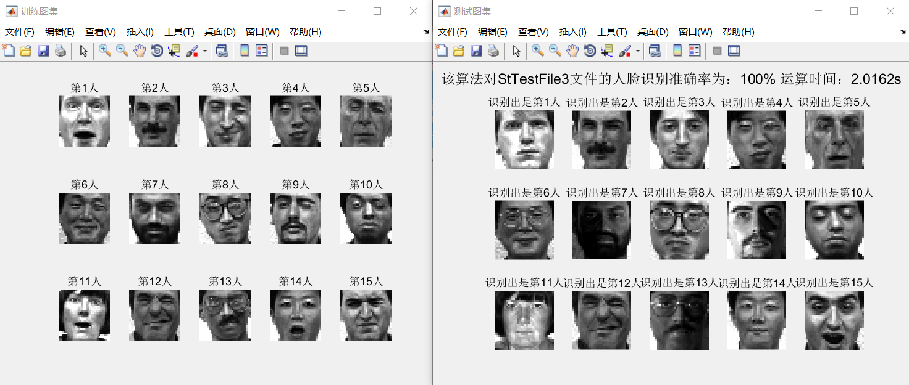

# MATLAB实验

## 一、说明

简单整理了一下实验五的人脸识别的代码，下载即可运行（只整理了StTrainFile2.txt和StTestFile3.txt，一个训练文件和一个测试文件，想改代码测试需下载其他txt格式数据）。其他实验的代码虽然报告中有，懒得整理了~

_(:⑧」∠)_猪

## 二、人脸识别（有待改进）效果图：

## 三、我上《数学实验》课时的课件及资料如下：

链接：https://pan.baidu.com/s/1Otjpp7B8B2W_Fm8aiisB4g 

提取码：le88 